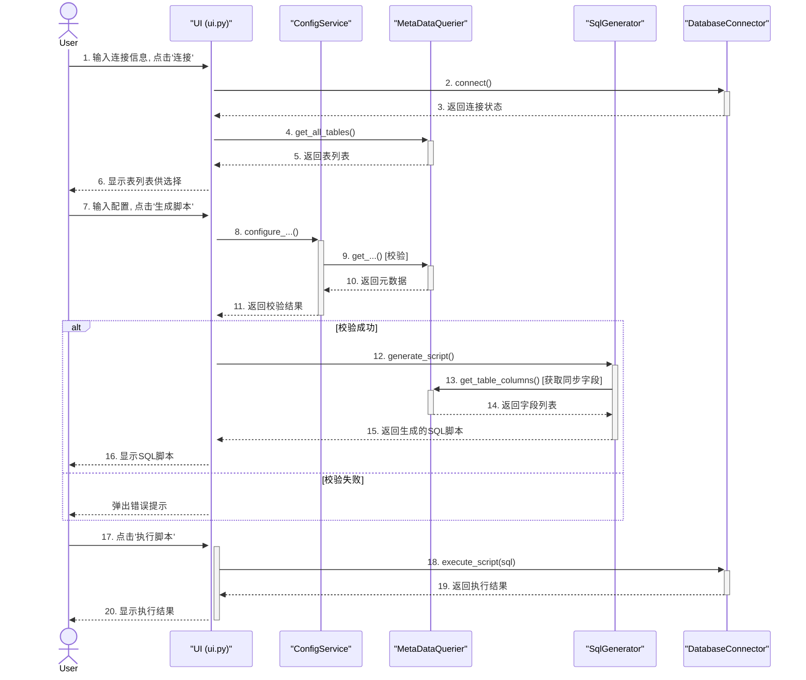

# 功能实现时序图

本文档使用 Mermaid 语法，描绘了用户从打开UI到最终执行脚本的完整交互流程和系统内部各模块的调用顺序。

```mermaid
sequenceDiagram
    actor User
    participant UI as "UI (ui.py)"
    participant ConfigService as "ConfigService"
    participant MetaDataQuerier as "MetaDataQuerier"
    participant SqlGenerator as "SqlGenerator"
    participant DB as "DatabaseConnector"

    User->>+UI: 1. 输入连接信息, 点击'连接'
    UI->>+DB: 2. connect()
    DB-->>-UI: 3. 返回连接状态
    UI->>+MetaDataQuerier: 4. get_all_tables()
    MetaDataQuerier-->>-UI: 5. 返回表列表
    UI-->>User: 6. 显示表列表供选择

    User->>+UI: 7. 输入配置, 点击'生成脚本'
    UI->>+ConfigService: 8. configure_...()
    ConfigService->>+MetaDataQuerier: 9. get_...() [校验]
    MetaDataQuerier-->>-ConfigService: 10. 返回元数据
    ConfigService-->>-UI: 11. 返回校验结果

    alt 校验成功
        UI->>+SqlGenerator: 12. generate_script()
        SqlGenerator->>+MetaDataQuerier: 13. get_table_columns() [获取同步字段]
        MetaDataQuerier-->>-SqlGenerator: 14. 返回字段列表
        SqlGenerator-->>-UI: 15. 返回生成的SQL脚本
        UI-->>User: 16. 显示SQL脚本
    else 校验失败
        UI-->>User: 弹出错误提示
    end

    User->>+UI: 17. 点击'执行脚本'
    UI->>+DB: 18. execute_script(sql)
    DB-->>-UI: 19. 返回执行结果
    UI-->>-User: 20. 显示执行结果
```
