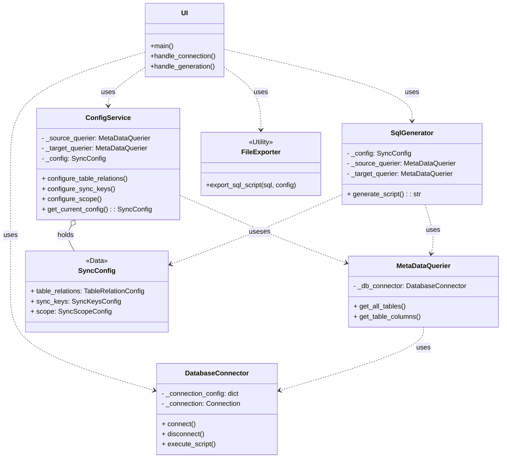

# 系统关系图 (类图)

本文档使用 Mermaid 语法，描绘了系统中各个核心类之间的静态关系，包括依赖、使用和聚合关系。

```mermaid
classDiagram
    class UI {
        +main()
        +handle_connection()
        +handle_generation()
    }
    class ConfigService {
        - _source_querier: MetaDataQuerier
        - _target_querier: MetaDataQuerier
        - _config: SyncConfig
        + configure_table_relations()
        + configure_sync_keys()
        + configure_scope()
        + get_current_config(): SyncConfig
    }
    class SqlGenerator {
        - _config: SyncConfig
        - _source_querier: MetaDataQuerier
        - _target_querier: MetaDataQuerier
        + generate_script(): str
    }
    class MetaDataQuerier {
        - _db_connector: DatabaseConnector
        + get_all_tables()
        + get_table_columns()
    }
    class DatabaseConnector {
        - _connection_config: dict
        - _connection: Connection
        + connect()
        + disconnect()
        + execute_script()
    }
    class FileExporter {
        <<Utility>>
        +export_sql_script(sql, config)
    }
    class SyncConfig {
        <<Data>>
        + table_relations: TableRelationConfig
        + sync_keys: SyncKeysConfig
        + scope: SyncScopeConfig
    }
    
    UI ..> ConfigService : uses
    UI ..> SqlGenerator : uses
    UI ..> DatabaseConnector : uses
    UI ..> FileExporter : uses
    
    ConfigService o-- SyncConfig : holds
    ConfigService ..> MetaDataQuerier : uses
    
    SqlGenerator ..> SyncConfig : uses
    SqlGenerator ..> MetaDataQuerier : uses
    
    MetaDataQuerier ..> DatabaseConnector : uses
```
