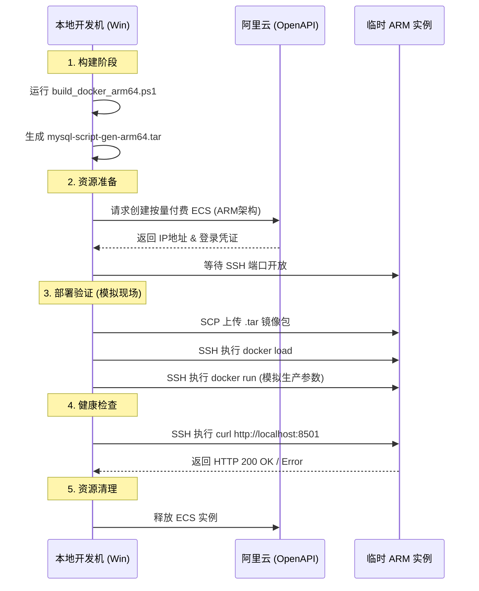

# 基于阿里云 ECS 的 Docker 镜像自动化验证方案

- **日期**: 2025-12-08
- **状态**: 拟定中
- **目标**: 解决内网交付缺乏预验证环节的问题，建立“本地构建 -> 云端验证 -> 内网交付”的质量关卡。

---

## 1. 问题背景

当前交付流程直接从“本地开发机”跳跃到“客户内网现场服务器”。由于环境差异（特别是 x86 开发机与 ARM 生产环境的差异），经常出现：
1.  **架构不兼容**: `exec format error`。
2.  **路径/权限问题**: 如 `exec streamlit failed`。
3.  **依赖缺失**: 运行时报错。

## 2. 解决方案核心

在交付给现场之前，引入**阿里云 ECS（按量付费）**作为“模拟考场”。

### 关键决策：架构选型

由于目标环境是 **麒麟 ARM 服务器**，我们在阿里云上必须租用 **ARM 架构实例**（如倚天 710 处理器系列，规格代码包含 `y`，如 `ecs.c8y.large`）进行验证。
*如果在 x86 ECS 上验证 ARM 镜像，只能通过 QEMU 模拟，速度慢且无法完全复现底层兼容性问题。*

## 3. 自动化验证流程 (Pipeline)

我们设计一个自动化脚本 `scripts/verify_on_aliyun.py`，执行以下全链路操作：

## 4. 实现方案细节

### 4.1 技术栈
- **语言**: Python (复用现有的运维脚本体系)
- **SDK**: `aliyun-python-sdk-ecs` (管理实例), `paramiko` (SSH 连接与文件传输)
- **成本**: 每次验证耗时约 5-10 分钟。ARM 实例（如 `ecs.c8y.large`）按量价格极低（约 0.2-0.5 元/小时），单次验证成本忽略不计。

### 4.2 验证脚本原型 (`scripts/verify_on_aliyun.py`)

脚本将包含以下核心功能：
1.  **Provision**: 检查是否有存活的测试实例，没有则购买新建。
2.  **Deploy**: 传输 `tar` 包（模拟现场的 U 盘拷贝/内网传输）。
3.  **Test**: 
    - 检查容器是否存活 (`docker ps`).
    - 检查服务端口响应 (`curl`).
    - 检查日志是否有报错 (`docker logs`).
4.  **Teardown**: 验证通过或失败后，自动销毁实例（可配置保留以便 Debug）。

## 5. 预期收益

1.  **100% 架构兼容性验证**: 确保发给现场的 ARM 包一定能跑。
2.  **环境隔离测试**: 验证 Dockerfile 是否遗漏了依赖（在一个干净的 ECS 上跑，而不是在可能有缓存的开发机上跑）。
3.  **提升交付信心**: 交付人员拿到的是经过云端“盖章”的通过包。

---

## 6. 下一步行动

1.  [ ] 申请阿里云 AccessKey (AK/SK)。
2.  [ ] 编写 `scripts/verify_on_aliyun.py` 脚本。
3.  [ ] 集成到 `build.bat` 或 `build_docker_arm64.ps1` 中，增加 `--verify` 选项。

