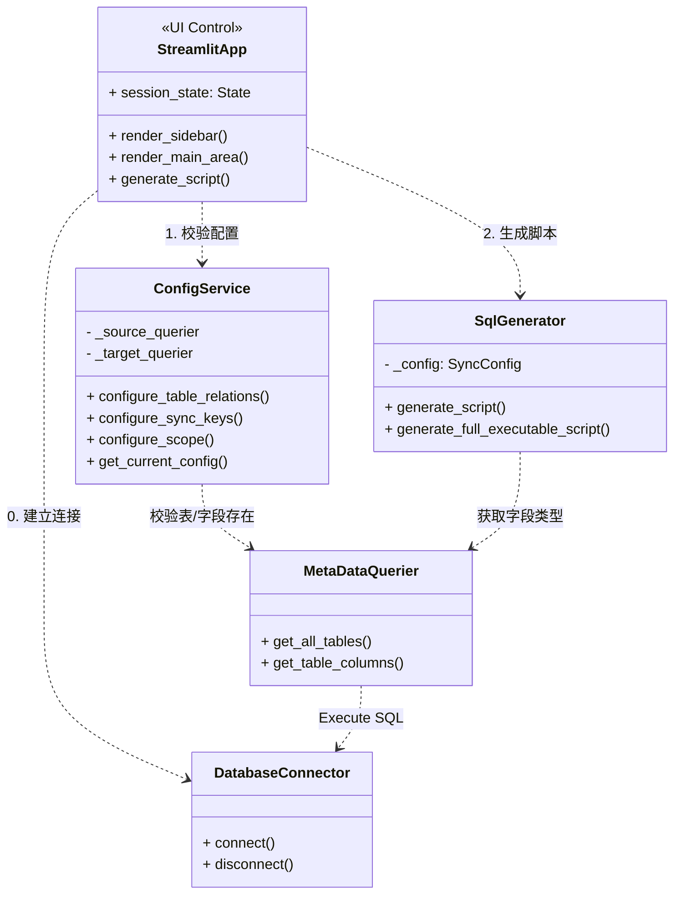
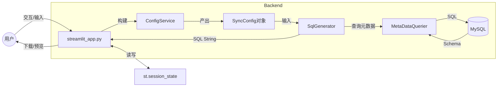

# 🗺️ 项目导航地图 (Project Navigation Map)
> 最后更新: 2025-11-21
> 状态: V2.3 (AI 资产收录版)

## 1. 核心地形 (Project Topology)

本项目是一个 **MySQL 主从表数据同步脚本生成工具**。它使用 Streamlit 构建 Web GUI，接收用户配置，读取数据库元数据，自动生成用于同步数据的 MySQL 存储过程脚本。

* 📂 **根目录**:
    * 📄 `streamlit_app.py`: **控制塔 (Control Tower)**。项目的核心启动入口。
        * **职责**: 状态管理 (`session_state`)、界面渲染（含**可视化过滤规则构建器**）、用户交互以及协调后端服务。
        * **关键防御**: 内置 `check_suicide_risk()` 防止源/目标表配置冲突。
    * 📄 `run.py`: **启动器 (Launcher)**。PyInstaller 打包专用入口，负责处理 `_MEIPASS` 路径映射并调用 `streamlit.web.cli`。
    * 📄 `connection_profiles.json`: **配置存档**。本地存储的数据库连接历史（JSON 格式）。
    * 📄 `main.py`: **演习场 (Playground)**。用于无 GUI 环境下的核心流程测试。

* 📂 `prompts-library/` - **AI 指挥所 (AI Command Post)**:
    * 存放 V2.0 协作模式的核心资产。包含 `roles/` (各职能 AI 的人格定义) 和 `guides/` (协作方法论)。**这是本项目区别于传统开发模式的核心区域。**

* 📂 `scripts/` - **兵工厂 (Arsenal)**:
    * 📄 `build.py`: **打包流水线**。负责环境清理、依赖检查，并调用 PyInstaller 生成单文件 EXE。包含处理 Streamlit hook 的复杂逻辑。

* 📂 `src/core/` - **基础设施 (Infrastructure)**:
    * 📄 `db_connector.py`: **连接器**。基于 `pymysql`。目前仅封装基础连接，**无连接池**，长连接易断开。
    * 📄 `metadata_querier.py`: **侦察兵**。直接查询 `information_schema`。前端下拉框和生成器获取字段信息的唯一来源。

* 📂 `src/generator/` - **核心工厂 (Core Factory)**:
    * 📄 `sql_generator.py`: **大脑**。逻辑密度最高。
        * **核心产出**: 包含 `DECLARE`, `CURSOR`, `LOOP`, `TRANSACTION` 的完整存储过程。
        * **关键机制**: 实现了循环内的微事务控制 (`START TRANSACTION` ... `COMMIT`)。

* 📂 `src/services/` - **战略部 (Strategy)**:
    * 📄 `config_service.py`: **参谋**。负责组装、校验同步配置，确保“生成的脚本不会报错”。

* 📂 `src/utils/` - **后勤 (Logistics)**:
    * 📄 `file_exporter.py`: **运输队**。负责生成的 SQL 文件落盘。

### 🏗️ 系统架构蓝图 (Architecture Blueprint)

## 2. 数据补给线 (Data Flow Pipeline)

### 🌊 宏观数据流 (Macro Data Flow)

## 3. 关键路标与职责 (Module Registry)

| 模块/类 | 职责 (One-liner) | 输入 | 输出 | 依赖 |
| :--- | :--- | :--- | :--- | :--- |
| **`streamlit_app.py`** | **GUI 总控**。包含 `check_suicide_risk` 安全检查、智能表名联动、可视化过滤规则编辑器。 | 用户点击 | 页面刷新/SQL | `streamlit`, `src.*` |
| **`build.py`** | **构建脚本**。一键打包 EXE，处理 Streamlit 隐式依赖和 metadata 复制。 | 源代码 | `/dist/*.exe` | `PyInstaller` |
| **`ConfigService`** | **配置校验**。确保用户填写的表名、字段名真实存在且类型兼容。 | 表名, 字段名 | `SyncConfig` | `MetaDataQuerier` |
| **`SqlGenerator`** | **代码生成**。拼接存储过程字符串。**注意**: 包含 `_get_column_sql_type` 类型转换逻辑。 | `SyncConfig` | `dict` (SQL Parts) | `datetime` |
| **`MetaDataQuerier`** | **元数据读取**。封装 `information_schema` 查询。 | `DatabaseConnector` | 字典/列表 | `mysql-connector` |

## 4. 故障多发区 (Trouble Spots)

*   🛡️ **自杀式配置风险 (已防御)**:
    *   **状态**: `streamlit_app.py` 中的 `check_suicide_risk` 已实装。
    *   **监控**: 修改 UI 逻辑时，**严禁移除**此检查函数，否则可能导致用户清空源库数据。
*   🚩 **微事务与游标 (`src/generator/sql_generator.py`)**:
    *   **风险**: Loop 内的 `SELECT INTO` 若触发 `NOT FOUND`，可能错误触发外层 Loop 的退出条件。
    *   **现状**: 代码已使用 `BEGIN ... END` 块包裹内部查询并定义局部 Handler。**代码维护时需维持此结构，不可简化。**
*   🚩 **连接超时 (`src/core/db_connector.py`)**:
    *   **风险**: 项目**未使用连接池**。Streamlit 长时间（>8h）闲置后点击按钮必报 `MySQL server has gone away`。目前无自动重连机制。
*   🚩 **复杂字段类型 (`src/generator/sql_generator.py`)**:
    *   **逻辑**: `_get_column_sql_type` 仅处理了 `VARCHAR`/`DECIMAL` 等基础带参类型。
    *   **风险**: 对于 `ENUM`, `SET`, `GEOMETRY`, `JSON` 等类型，代码目前直接透传数据库返回的类型字符串，可能会导致生成的 `DECLARE` 语句语法错误。

## 5. 待探索区域 (Uncharted Territory)

*   **🚨 README.md 滞后**: 项目根目录的 `README.md` 目前仍是 "Cursor AI 协作模板母版" 的默认内容，严重误导用户。需紧急更新为本工具的使用说明。
*   **复杂类型实测**: 尚未针对包含 `ENUM`, `SET`, `JSON` 类型的测试表，验证生成的存储过程是否有效。
